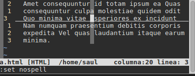
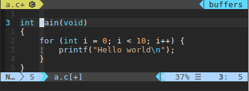
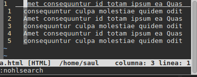
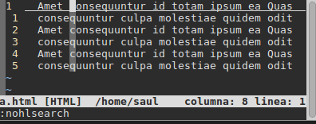
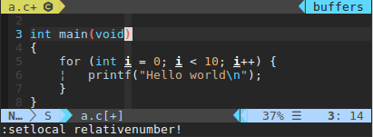
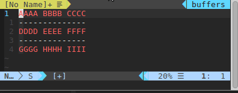
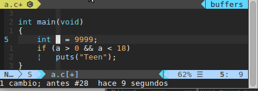
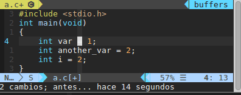
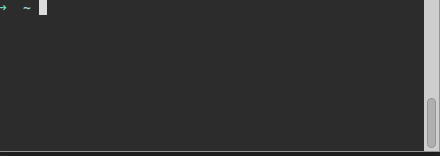
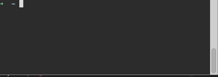

# VIM

A large and somewhat ineficient configuration of vim that is now
configurable through the variables.
Being [neo]vim my main working tool and its configuration one of the things
I edit the most according to my personal preferences, the main config file
"vimrc" and code are written in spanish and I'm probably not changing it.
You are welcome to contact me asking for the meaning of any part of it but
google translate will do it for most of it.
********************************************************************************
Una configuración grande y algo ineficiente de vim que ahora es configurable
a través de variables.
Siendo [neo]vim mi principal herramienta de trabajo y su configuración una de
las cosas que mas edito de acuerdo a mis preferencias personales, el archivo
principal de configuración "vimrc" y el código están escritos en español y
probablemente eso no cambie.

## Features

There are plenty of plugins in the vimrc (if enabled) I will not talk you about
because you can check them yourself. Some of the features that do not depend on
plugins are:
********************************************************************************
Hay varios plugins en el vimrc (si se habilitan) de los que no te hablaré puesto
que puedes revisarlos tu mismo. Algunas de las características que no depende de
plugins son:

    System clipboard by default | Portapapeles del sistema por defecto

    Current line/column highlighted | Resaltado de la línea/columna actual

    Incremental search/replace | Busqueda/reemplazo incremental

    # and * don't move cursor | # y * no mueven el cursor

    # and * can be used with selection | # y * se pueden usar en una selección

    Mouse enabled by default | Mouse habilitado por defecto

    <F3> to toggle relativenumber | <F3> para alternar relativenumber

    Move past end of line | Moverse pasado el final de la línea

    h and l wrap line | h y l le dan la vuelta a la línea

    Move text around | Mover texto alrededor

    "buffer" and "line" text object | Objetos de texto "buffer" y "línea"

    Surround words and text | Rodear palabras y texto

    Automatic file reading | Recarga automática de archivos

    Command "Alinear" to align text | Comando "Alinear" para alinear texto

    - Command "DiffOrigen" to diff unsaved changes

    - Restore cursor position in file | Restaurar posición del cursor en archivo

********************************************************************************

## Setup

The easy setup only consists of copying the file "vimrc" into the location used
by vim/neovim. IE:

    cp vimrc ~/.vimrc # For vim

or

    cp vimrc ~/.config/nvim/init.vim # For neovim

With that, you will have almost all the features except for some modified
versions of files from some plugins.

If you (for some strange reason) also want to setup those modified files, you
must first ensure that the plugins are enabled in the vimrc and later simply run
setup_vim.sh inside a bash compatible shell (as the git bash on windows or any
console in linux/max):

    ./setup_vim.sh

The flags "-n" can be send to the script to configure nvim or "-w" to
configure nvim-qt in windows.

********************************************************************************

La forma sencilla de usar la configuración es copiar el archivo "vimrc" en la
ubicación usada por vim/neovim. PE:

    cp vimrc ~/.vimrc # Para vim

o

    cp vimrc ~/.config/nvim/init.vim # Para neovim

Con eso tentras caso todas las características exceptuando algunas versiones
modificadas de archivos provenientes de algunos plugins.

Si tu (por alguna extraña razón) también quieres usar esos plugins modificados,
lo primero es asegurarte de que los plugins están habilitados en "vimrc" y luego
simplemente ejecutar setup_vim.sh dentro de una shell compatible con bash (como
la git bash en windows o cualquier consola en linux/mac):

    ./setup_vim.sh

La bandera "-n" puede enviarse al script para configurar todo para nvim o "-w"
para configurar nvim-qt en windows.

## Configuration / Configuración

The following integer (boolean) variables are present in the first part of
"vimrc" file and control some of the features of the configuration file.
********************************************************************************
Las siguientes variables enteras (booleanas) están presentes en la primera parte
del archivo "vimrc" y controlan algunas de las características de la
configuración.

s:usar_plugins

    Defines whether or not activate the plugin manager and its plugins.
    ____________________________________________________________________________
    Define si activar el manejador de plugins y sus plugins.
    Default: 0

s:envolver_lineas_largs

    Defines whether or not wrap long lines.
    ____________________________________________________________________________
    Define si envolver o no las líneas largas.
    Deault: 0

s:usar_portapapeles_del_sistema

    Defines whether or not to use the system clipboard in every copy/paste/cut
    operation. Vim normally uses its own registers for these operations.
    ____________________________________________________________________________
    Define si usar la papelera del sistema para las operaciones de
    copiar/pegar/cortar. Vim normalmente usa sus propios registros para dichas
    operaciones.
    Default: 1

s:usar_respaldo_local

    Defines whether or not save backup and swap files.
    ____________________________________________________________________________
    Define si guardar archivos de backup y swap.
    Default: 0

s:activar_revision_ortografica

    Defines whether or not to show misspelled words in the files.
    ____________________________________________________________________________
    Define si mostrar palabras mál escritas de los archvos.
    Default: 0

s:revision_otrografica_en_espaniol

    With the value of 1, the spell checking is made in spanish. Otherwise,
    english is used.
    ____________________________________________________________________________
    Si se asigna 1, se usa revisión otrográfica en español. Si no, se usa
    inglés.

